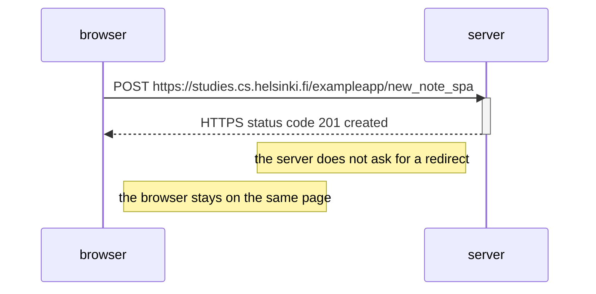

```mermaid
sequenceDiagram
    participant browser
    participant server

    browser->>server: POST https://studies.cs.helsinki.fi/exampleapp/new_note_spa
    activate server
    server-->>browser: HTTPS status code 201 created
    deactivate server

    Note left of server:  the server does not ask for a redirect

    Note right of browser: the browser stays on the same page
```